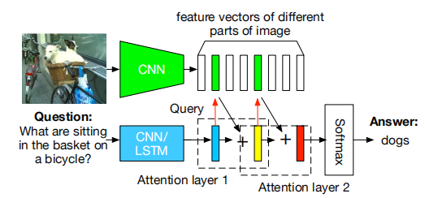

# Stacked Attention Network

## 模型功能

- 使用多层 Attention 识别图像中不同区域与句子向量的相关程度。
- 筛选与句子向量有关的区域，与答案建立联系。
- 输入问题：What are sitting in the basket on a bicycle?
- 输入图片：

- 经过两层 Attention:

  

- 输出答案：Dogs.

- 整体模型结构：

  

## Attention Distribution

- 在SAN中，最核心的问题为 Attention Distribution: 图片中的每个区域与问题的关联程度 (Attention) 为多少？

- 为此，我们先利用CNN和Bert对图像和问题进行编码：
  $$
  v_I \in R^{d \times m} \\
  v_Q \in R^d
  $$
  其中，$v_I$ 为编码后的图像矩阵，$v_Q$ 为编码后的问题句向量，d为表示维度，m是图像中区域的个数（利用CNN）。

- Attention 通过如下计算得到：
  $$
  h_A = \text{tanh}(W_I v_I \oplus W_Q v_Q) \\
  p_I = \text{softmax}(W_p h_A)
  $$
  我们首先让$v_I$ $v_Q$ 分别通过全连接层，使得它们的维度变为 $R^{k \times m}$ 和 $R^k$. 这里，$\oplus$ 操作代表把向量加到矩阵的每一列上。图像矩阵的每一列代表每个兴趣区域，因此这里的操作实际上就是把句子向量与每个兴趣区域做融合。由此再将 $h_A$ 通过全连接层和 Softmax，就得到了图像中每个区域在特定句子中能成为兴趣区域的可能性，也就是我们的 **Attention Distribution**.

- 有了 Attention Distribution 后，我们利用它计算每个区域的权重和 $\hat{v_I} \in R^d$：
  $$
  \hat{v_I} = \sum_i p_i v_i
  $$
  接着，把这个向量与句向量相加，得到整合后的查询向量  $u \in R^d$。
  $$
  u = \hat{v_I} + v_Q
  $$

- 以上就是单层Attention的思路。

- 单层 Attention 的表示性并不强，所以我们可以使用多层 Attention，即将查询向量作为新的问题向量，不断输入Attention层进行迭代：
  $$
  h_A^k = \text{tanh}(W_I^k v_I \oplus W_Q^k u^{k-1}) \\
  p_I = \text{softmax}(W_p^k h_A^k) \\
  \hat{v_I}^k = \sum_i p_i^k v_i \\
  u^k = \hat{v_I}^k + u^{k-1}
  $$
  经过K次Attention迭代后，我们使用全连接层和Softmax推理答案：
  $$
  p_{\text{ans}} = \text{softmax}(W_u u^K)
  $$

## Attention方法相较传统方法的优势

- 传统方法仅仅是将整体图片向量与问题向量合并，对区域信息不敏感。
- 相较于传统方法，Attention方法得到的查询向量 $u$ 更具有信息表示性，因为与问题更相关的区域得到了更高的权重。