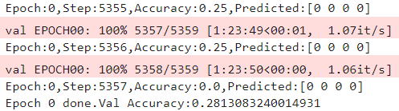

### 3 Experiment Results

#### 3.1 实验结果

参数：

+ `batch_size`：4，`learning rate`： 2e-3

训完一个epoch：

#### 3.2 总结说明

##### 1 问题

由于算力有限，我们每个人能训练的`epoch`有限，但是训练两三个`epoch`后结果提升很少，整个`VQA`网络倾向于直接预测最简单的答案，导致最终的结果比较差。

##### 2 分析

问题原因分析如下：

1. 算力有限，无法将模型训练至收敛
2. `backbone`特征提取网络是自己搭建的`CNN`模型，没有预训练，在训练过程中比较难以收敛，导致在特征提取上出了问题
3. 替换了原有网络的子部件，融合上可能有一定问题