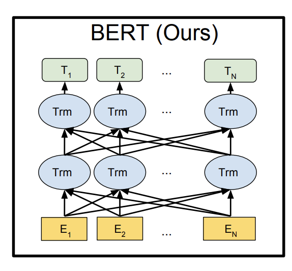
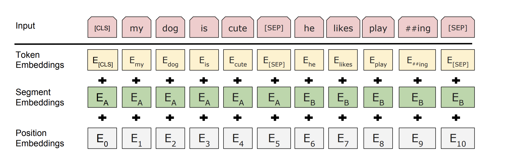

<div class="cover" style="page-break-after:always;font-family:方正公文仿宋;width:100%;height:100%;border:none;margin: 0 auto;text-align:center;">
    <div style="width:55%;margin: 0 auto;height:0;padding-bottom:10%;">
        </br>
        
    </div>
</br></br></br></br></br></br></br></br></br>
    <div style="width:60%;margin: 0 auto;height:0;padding-bottom:40%;">
        
	</div>
    </br></br></br></br></br></br></br></br>
</br>
</br>
    <span style="font-family:华文黑体Bold;text-align:center;font-size:28pt;margin: 10pt auto;line-height:26pt;">Visual Question Answering</span>
</br></br>
    <span style="font-family:华文黑体Bold;text-align:center;font-size:26pt;margin: 10pt auto;line-height:24pt;">DL4NLP Final Project</span>
</br>
</br>
</br>
</br>
	<span style="font-family:华文黑体Bold;text-align:center;font-size:20pt;margin: 10pt auto;line-height:30pt;">蒋景伟</span>
</br>
</br>
	</br>
</br>
<span style="font-family:华文黑体Bold;text-align:center;font-size:20pt;margin: 10pt auto;line-height:30pt;">Data: 2022-06-26</span>
    <table style="border:none;text-align:center;width:72%;font-family:仿宋;font-size:14px; margin: 0 auto;">


<font color=6d8ab5 size = 6>目录:</font>

<font size = 4>

[toc]


</font>

<div STYLE="page-break-after: always;"></div>

## 1 Project Introduction

### 1.1 选题

+ Visual Question Answering

### 1.2 工作简介

+ 以一张图片和一个关于图片内容的自然语言形式的问题作为输入，要求输出正确答案
+ 在数据集`VQAv2`上进行训练与测试
+ 属于一种多标签分类的问题，计算损失的时候采用多标签损失。

### 1.3 开发环境

+ 开发工具：`ModelArts Ascend Notebook`环境，选用`Ascend910`芯片作为训练芯片

+ 开发包、开源库：
  1. Mindspore1.3.0
  2. numpy

+ 系统运行要求：

  `python3.7.5`与可运行`Mindspore1.3.0`的开发环境

## 2 Technical details

### 2.0 环境设置

由于`Modelarts`不能直接同步`obs`内的文件，因此需要先同步文件。此外，还需要通过`mindspore.context`设置训练芯片和模式。

```python
import moxing as mox
from mindspore import context
mox.file.copy_parallel(src_url="s3://focus/nlp/data/", dst_url='../data/')
mox.file.copy_parallel(src_url="s3://focus/nlp/nlp_vqa/", dst_url='.')
context.set_context(mode=context.PYNATIVE_MODE, device_target='Ascend')
```

### 2.1 DataLoader

#### 2.1.1 数据集简介

使用`VQAv2`数据集，分为`image`，`question`和`annotation`三个大的数据集，官网数据量如下：

|            | train   | val     | test   |
| ---------- | ------- | ------- | ------ |
| image      | 82783   | 40504   | 81434  |
| question   | 443757  | 214354  | 447793 |
| annotation | 4437570 | 2143540 | —      |

我们使用的是课程要求的数据集，数据量如下：

+ train: 44375，validation: 21435，test: 21435

数据集的构成如下：

- 1张图片有大概5个问题
- 1个问题有10个答案
- test没有annotation文件

下面具体介绍问题与回答的数据构成：

###### 1 Question

根据官网的解释可知，**question**被保存为`JSON`文件的格式，其具有数据结构如下：

```python
question{
"question_id" : int,  #问题id
"image_id" : int,     #问题对应的图片id
"question" : str      #具体的问题
}
```

###### 2 Annotation

根据官网的解释可知，**Annotation**也被保存为`JSON`文件的格式，其具有数据结如下：

```python
annotation{
"question_id" : int,
"image_id" : int,
"question_type" : str,          #问题类型
"answer_type" : str,			#答案类型
"answers" : [answer],
"multiple_choice_answer" : str
}
------------------------------
answer{
"answer_id" : int,
"answer" : str,				   #具体答案
"answer_confidence": str
}
```

#### 2.1.2 数据预处理

###### 1 数据对齐

首先是对问题与答案进行对齐，剔除没有一一对应关系的问题或答案，该部分代码在`match_align/align.py`中，运行后发现所有问题答案均已对齐。

###### 2 图片与问题对齐

前面提到，一张图片对应5个问题左右，需要将图片与问题对齐，剔除没有一一对应关系的问题或图片，该部分代码在`match_align/match.py`中，运行后发现所有训练集中有部分问题没有对应图片，因此去除该部分的问题，重新整理后写回`JSON`文件。

#### 2.1.3 数据集加载

由任务可知，我们需要把数据集加载成`img`, `question`, `answers`的形式，数据类型与预处理如下：

1. `img`：图片为三通道`RGB`模式，加载成三维的`Tensor`即可
2. `question`：预处理，进行词形还原，大小写转换等，再通过预训练的`Tokenizer`进行`one-hot`编码，扩充成定长向量输出。
3. `Answers`：预处理，进行词形还原，大小写转换等，自己构造词汇表进行`one-hot`编码

自定义数据集需要重载两个函数：

1. `__getitem__`：根据输入的下标选取对应的数据
2. `__len__`：获取数据集长度

完成后加载为`DataLoader`格式，调用相关函数即可，这里可以灵活设置`batch_size`与图片的增强模式（在`config.py`中完成定义即可）。

最终每一个`batch`的数据如下所示：问题编码为128维，图片为224*224维。


### 2.2 img特征提取

在大多数的VQA模型中，都是选择提前处理好的图像特征作为输入。我们尝试手动搭建卷积网络，直接将图片输入网络进行特征提取。（此处可列为创新点）首先在`dataest.py`中对图像进行预处理，保证图像的大小为`224x224`。

```python
def trans_gen( train=False, val=False, test=False ):
    mode = 'train' if train else 'val'
    transforms_dict = {
        'train':[
            decode,
            py_trans.Resize(size=(224, 224)),
            py_trans.RandomHorizontalFlip(0.2),
            py_trans.ToTensor(),
            py_trans.Normalize([0.485, 0.456, 0.406], [0.229, 0.224, 0.225])
        ],
        'val':[
            decode,
            py_trans.Resize(size=(224, 224)),
            py_trans.ToTensor(),
            py_trans.Normalize([0.485, 0.456, 0.406], [0.229, 0.224, 0.225])
        ]}

    return Compose(transforms_dict[mode])
```

在`san.py`中，使用`nn.SequentialCell`搭建特征提取网络`simple_cnn`。具体网络如下，其输出大小为`batch_sizex14x14x768`

```python
self.simple_cnn = nn.SequentialCell([
            nn.Conv2d(self.in_channels, self.channels, kernel_size=3, stride=2, padding=0, pad_mode='same'),
            nn.BatchNorm2d(self.channels, eps=1e-4, momentum=0.9, gamma_init=1, beta_init=0, moving_mean_init=0, moving_var_init=1),
            nn.ReLU(),
            nn.MaxPool2d(kernel_size=3, stride=2, pad_mode="same"),
            nn.Conv2d(self.channels, self.channels * 2, kernel_size=3, stride=1, padding=0, pad_mode='same'),
            nn.BatchNorm2d(self.channels*2),
            nn.ReLU(),
            nn.MaxPool2d(kernel_size=2,stride=2),
            nn.Conv2d(self.channels * 2, self.channels*4, kernel_size=3, stride=1, padding=0, pad_mode='same'),
            nn.BatchNorm2d(self.channels * 4),
            nn.ReLU(),
            nn.MaxPool2d(kernel_size=2,stride=2),
            nn.Conv2d(self.channels*4, output_size, kernel_size=3, stride=1, padding=0, pad_mode='same')
        ])
```

为了方便后续的特征融合，在模型的`construct`中统一输出大小为`batch_sizex196x768`

```python
def construct(self, x):
    x = self.simple_cnn(x)
    N = x.shape[0]
    return x.reshape((N, 196, self.output_size))
```


### 2.3 text特征提取

Text特征提取是VQA当中不可缺少的一部分，这部分的作用是将提问部分的信息抽取出来，进行抽象表示，为接下来的特征融合做准备。

#### 2.3.1 LSTM

在我们参考的论文当中，原论文使用了LSTM作为Text特征提取器，其原理如下：


LSTM中的核心结构是一个记忆单元$c_t$，它负责存储一个输入序列的状态。在每一步操作中，LSTM会接收一个单词的输入$x_t$，然后对$c_t$进行更新，并输出一个隐藏状态$h_t$。这个更新过程使用了门技术。一个遗忘门$f_t$控制有多少信息能够从上一状态$c_{t-1}$当中保留下来；一个输入门$i_t$控制有多少信息能够从输入$x_t$中被用来更新记忆单元；一个输出门$o_t$控制有多少信息会被作为隐藏状态提供给输出。具体公式如下：


当我们给定一个问题$q=[q_1,...,q_T]$的时候，其中$q_t$是t位置上单词的one-hot向量表示。我们首先先将单词做embedding处理，即$x_t=W_eq_t$。然后对于每个时刻，我们将embedding的向量提供给LSTM：


最后的输出$h_T$作为结果当做问题的表示$v_Q=h_T$

#### 2.3.2 BERT

当然，我们在实验中对Text特征提取的部分做了一些改进。我们将LSTM替换为了效果更加良好的BERT模型。

BERT的架构图如图所示：



BERT将输入的句子做了三次Embedding，分别是Token Embedding, Segment Embedding, Position Embedding。



Bert之后的架构最主要是经过了一个双向Transformer结构，通过保留Encoder而舍弃Decoder的操作，拥有了双向编码能力和强大的特征提取能力。

其中，Transformer的内容部件我们在平时的LAB当中已经学习过并使用了相关代码进行实验，因此这里就不再赘述。

#### 2.3.3 改进理由

Q：为什么我们在本次实验当中选用了BERT而不是保留原来的LSTM？

A：首先，LSTM本身是RNN的变种，是为了解决RNN存在的梯度消失问题而提出的模型，但这种通过限定梯度阈值来防止梯度消失的办法并不能彻底的解决问题。对于长度数量级更高的长句子，LSTM就会变得没有那么擅长。而BERT在处理长句子的任务上表现良好，Transformer的架构决定了它能够对较长句子进行很好的处理。其次，LSTM对于句子的理解能力没有BERT强。LSTM的结构决定了它只能够顺序研究整个句子，通俗来说就是只能够“向前看”。而BERT的双向结构赋予了它强大的特征提取能力，“回头看”的机制使得它对于处理单词在句子中位置所决定的语义挖掘更为拿手，从而使得整个句子的语义被提取得更加完善。

#### 2.3.4 实现中遇到的挑战

1.   Mindspore版本问题

     Huaweicloud上的Mindspore环境版本只有1.3.0，这个版本有很多没有能够支持或是实现的函数，导致后来运行调试的时候发生了很多意外。例如，`expand_dims()`作为`mindspore.Tensor`类的成员函数在我当时参考的最新版的文档中是实现的，而1.3.0版本并没有支持这个操作。网上也查不到任何的报错信息解读，ModelArts环境也不好调试。最后排查后使用了`mindspore.ops.ExpandDims`作为替代才顺利进行了实验。

2.   BERT预训练

     本来想自己进行BERT的预训练，然后对下游任务（即VQA）进行fine-tuning，但是后来发现模型的训练速度实在是不能接受。转而求其次，找到了mindspore的bert预训练ckpt文件，并通过对齐vocab的方式实现了预训练这一步。

### 2.4 特征融合与预测网络

#### 2.4.1 网络功能概述

在具体网络的搭建中，我们使用了一种名为 Stacked Attention Network [1] 的网络，它使用多层 Attention 识别图像中不同区域的敏感度。以如下的问题和图片为例。

- 问题：What are sitting in the basket on a bicycle?

- 图片：

  

经过两次Attention层后，Attention层成功预测出了兴趣区域[1]：


接下来，我们对具体的算法实现和背后的原理做简要分析。

#### 2.4.2 网络结构

在前面的部分中，我们使用了CNN和Bert分别对图像和问题进行了编码，得到了以下数据：
$$
v_I \in R^{d \times m} \\
v_Q \in R^d
$$
其中，$v_I$ 为编码后的图像矩阵，$v_Q$ 为编码后的问题句向量，d为表示维度，m是图像中区域的个数（利用CNN）。

在我们的Attention层中，最核心的问题是找到不同区域的权重，或者说，为兴趣区域的概率。为此，我们进行如下计算：
$$
h_A = \text{tanh}(W_I v_I \oplus W_Q v_Q) \\
p_I = \text{softmax}(W_p h_A) \\
\text{where:} \\
W_I, W_Q \in R^{k \times d}, W_P \in R^{1 \times k}
$$
我们首先让$v_I$ $v_Q$ 分别通过全连接层，使得它们的维度变为 $R^{k \times m}$ 和 $R^k$. 这里，$\oplus$ 操作代表把向量加到矩阵的每一列上。回顾图像矩阵的每一列代表每个兴趣区域的知识，这里的操作实际上是把句子向量与每个兴趣区域做融合。由此再将 $h_A$ 通过全连接层和 Softmax，就得到了图像中每个区域在特定句子中能成为兴趣区域的可能性，也称为我们的 **Attention Distribution**.

有了 Attention Distribution 后，我们利用它计算每个区域的权重和 $\hat{v_I} \in R^d$：
$$
\hat{v_I} = \sum_i p_i v_i
$$
接着，把这个向量与句向量相加，得到整合后的查询向量  $u \in R^d$。
$$
u = \hat{v_I} + v_Q
$$
以上就是单层Attention的思路。传统方法仅仅是将整体图片向量与问题向量合并，相较于传统方法，Attention方法得到的查询向量 $u$ 更具有信息表示性，因为与问题更相关的区域得到了更高的权重。不过，对于复杂问题，单层 Attention 的表示性并不强，所以我们可以使用多层 Attention，即将查询向量作为新的问题向量，不断输入Attention层进行迭代：
$$
h_A^k = \text{tanh}(W_I^k v_I \oplus W_Q^k u^{k-1}) \\
p_I = \text{softmax}(W_p^k h_A^k) \\
\hat{v_I}^k = \sum_i p_i^k v_i \\
u^k = \hat{v_I}^k + u^{k-1}
$$
经过K次Attention迭代后，我们使用全连接层和Softmax推理答案：
$$
p_{\text{ans}} = \text{softmax}(W_u u^K)
$$
整体网络结构图如下[1]：


### 2.5 模型训练及验证

由于VQA的输入有`question`和`img`，而mindspore自带的`WithLossCell`仅支持一个输入，因此需要自定义。

```python
class WithLossCell(nn.Cell):
    def __init__(self, model):
        super(WithLossCell, self).__init__(auto_prefix=False)
        self.loss = nn.SoftmaxCrossEntropyWithLogits()
        self.net = model

    def construct(self, q, a, img):
        out = self.net(q, img)
        loss = self.loss(out, a)
        return loss
```

训练模型的定义如下。其中，`TrainOneStepCell`是`mindspore`实现的训练网络包装方法

```python
#定义网络
model = san.SANModel()
#定义优化器
opt = nn.Adam(params=model.trainable_params())
#定义带Loss的网络
net_with_loss = WithLossCell(model)
#包装训练网络
train_net = TrainOneStepCell(net_with_loss, opt)
#设置训练模式
train_net.set_train(True)
```

对于模型的验证，由于`Tensor`的操作不太方便，且`nn.Cell`的`construct`对非`Tensor`的输出格式不是很友好，因此在`WithAccuracy`中我们仅将模型的预测结果做`argmax`操作后便输出，在后续的操作中进一步计算准确率并输出预测结果。

```python
class WithAccuracy(nn.Cell):
    def __init__(self, model):
        super(WithAccuracy, self).__init__(auto_prefix=False)
        self.net = model

    def construct(self, q, a, img):
        out = self.net(q, img)
        out = ops.Argmax(output_type=mindspore.int32)(out)
        return out, a
```

验证网路定义如下。

```python
#model即为训练网络中同一个model
eval_net = WithAccuracy(model)
#设置验证模式
eval_net.set_train(False)
```

准确率具体计算代码如下(一个`batch`)

```python
out, a = eval_net(q, a, img)
predicted = out.asnumpy()
ans = a.asnumpy()
batch_size = ans.shape[0]
acc = 0
for i in range(batch_size):
	if ans[i,predicted[i]]!=0:
        acc += 1
accuracy = acc / batch_size
```

### 3 Experiment Results

#### 3.1 实验结果

 系统界面、操作说明、运行结果

#### 3.2 总结说明


### 4 References

[1] Antol S ,  Agrawal A ,  Lu J , et al. VQA: Visual Question Answering[J]. International Journal of Computer Vision, 2015, 123(1):4-31.

[2] Yang, Zichao, et al. "Stacked attention networks for image question answering." *Proceedings of the IEEE conference on computer vision and pattern recognition*. 2016.

